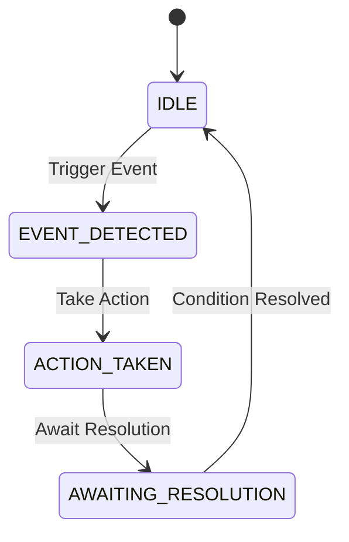

# Monitor->Action Coordinator Specification

**Version:** 1.0
**Effective Date:** 2025-10-29
**Authority:** Q33N (BEE-000)
**Status:** DRAFT - Awaiting User Approval

## 1. Overview

This document specifies the design for a new Monitor->Action Coordinator for the DEIA hive. This coordinator will replace the current passive monitoring system with a proactive one that can automatically respond to specific events and enforce hive policies.

## 2. State Machine

The coordinator will operate as a state machine with the following states:

*   **IDLE:** The coordinator is monitoring the hive for trigger events.
*   **EVENT_DETECTED:** A trigger event has been detected.
*   **ACTION_TAKEN:** An action has been taken in response to the event.
*   **AWAITING_RESOLUTION:** The coordinator is waiting for a condition to be resolved before returning to the IDLE state.

## 3. Test Plan

A comprehensive test plan will be developed to ensure the reliability of the coordinator. The plan will include:

*   **Unit Tests:** Tests for each individual component of the coordinator, including the state machine, event triggers, and actions.
*   **Integration Tests:** Tests to ensure that the coordinator integrates correctly with the rest of the hive's systems, including the telemetry system and the communication channels.
*   **End-to-End Tests:** Tests that simulate real-world scenarios, such as a `scope_drift` event, to ensure that the coordinator responds correctly.

## 4. Phased Rollout Plan

The coordinator will be rolled out in three phases:

*   **Phase 1: Passive Mode:** The coordinator will be deployed in a passive mode, where it will detect events and log the actions it *would* have taken, but will not actually take any action. This will allow us to test the coordinator in a production environment without any risk.
*   **Phase 2: Limited Action Mode:** The coordinator will be configured to take a limited set of non-destructive actions, such as sending notifications.
*   **Phase 3: Full Action Mode:** The coordinator will be fully enabled to take all defined actions, including freezing agents and reassigning tasks.

## 5. Ownership and Responsibilities

*   **Owner:** `CLAUDE-CODE-001` (Strategic Planner & Coordinator) will be the owner of the Monitor->Action Coordinator.
*   **Responsibilities:**
    *   Monitoring the coordinator's performance.
    *   Responding to any alerts or notifications from the coordinator.
    *   Updating the coordinator's configuration as needed.
    *   Reporting on the coordinator's activity to the Q33N.

## 6. Event Triggers

The coordinator will be triggered by the following events:

*   **`scope_drift`:** An agent attempts to access a file or resource outside of its authorized scope.
*   **`BUG-001` signal:** An agent signals that it has encountered a critical bug.
*   **Process Violation:** An agent violates an established protocol.
*   **Stale Heartbeat:** An agent's heartbeat has not been updated within the expected interval.

## 7. Actions

The coordinator will be able to take the following actions:

*   **`freeze`:** Immediately pause all activity for a specific agent.
*   **`notify`:** Send a notification to the Q33N and/or other relevant agents.
*   **`log`:** Create a new incident report in the `.deia/incidents/` directory.
*   **`reassign`:** Reassign a task from one agent to another.
